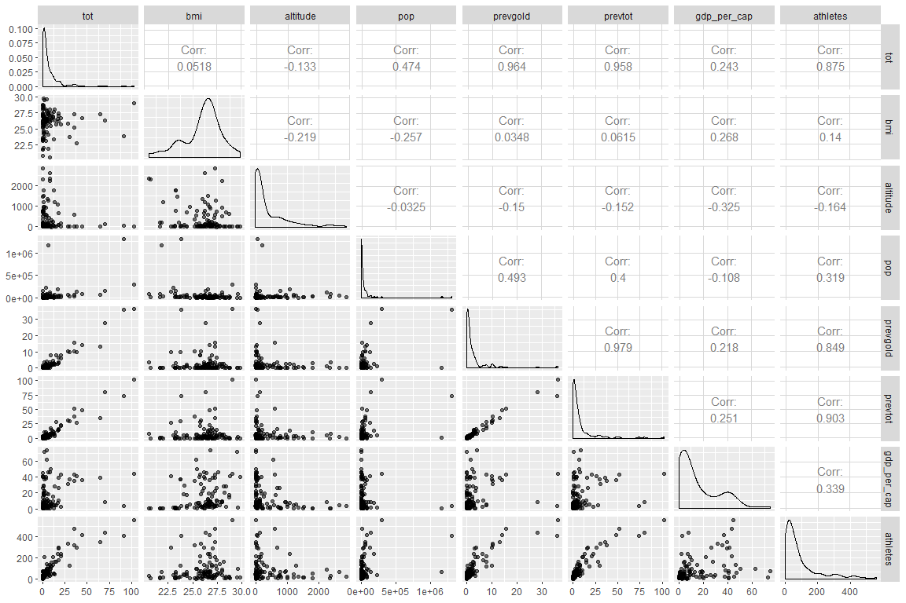
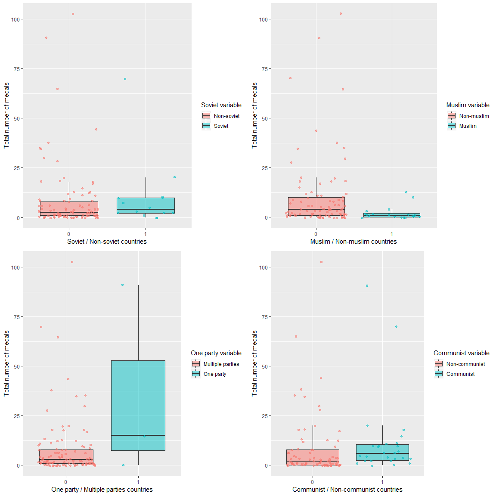
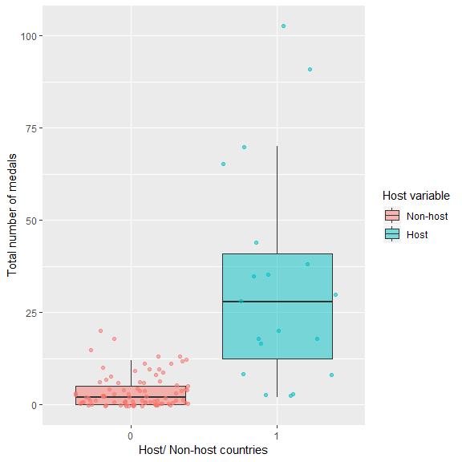
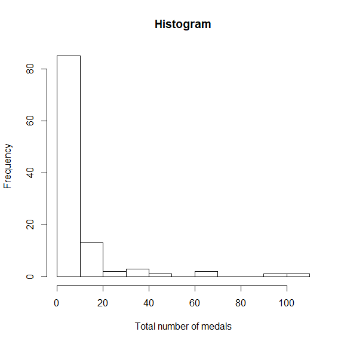
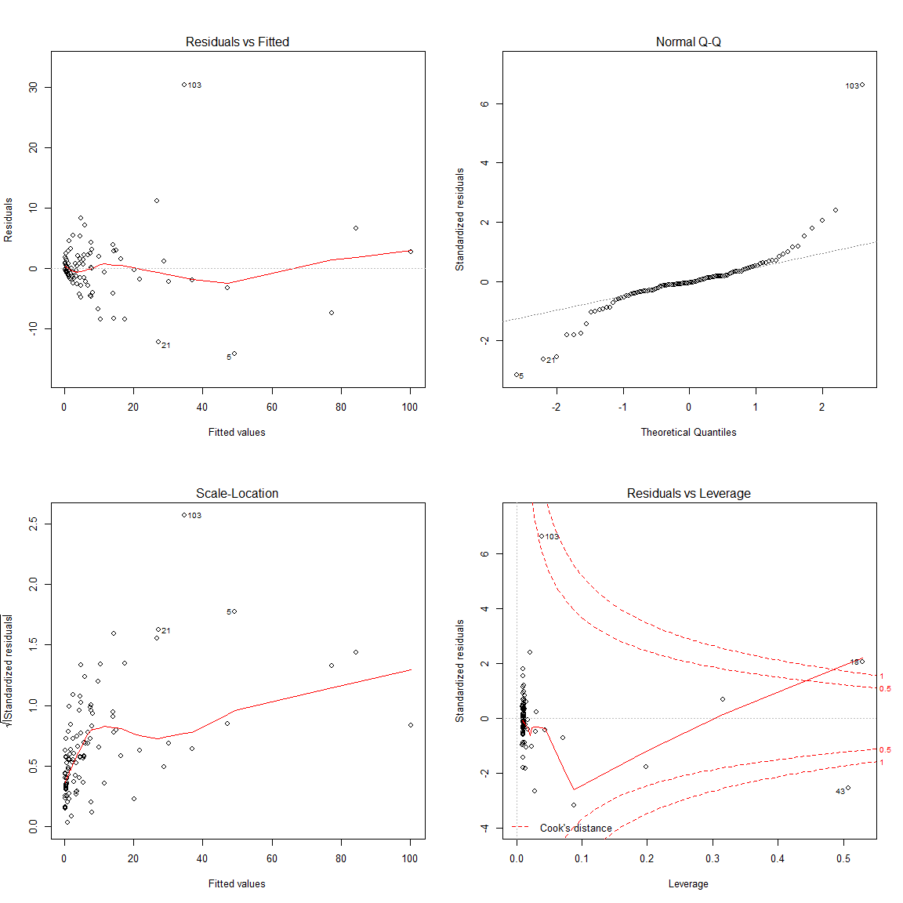
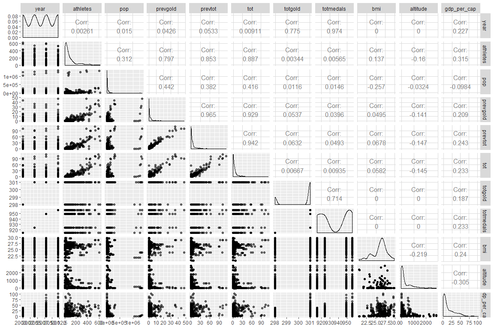
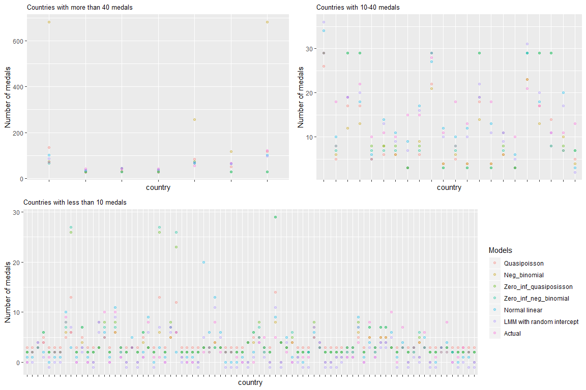
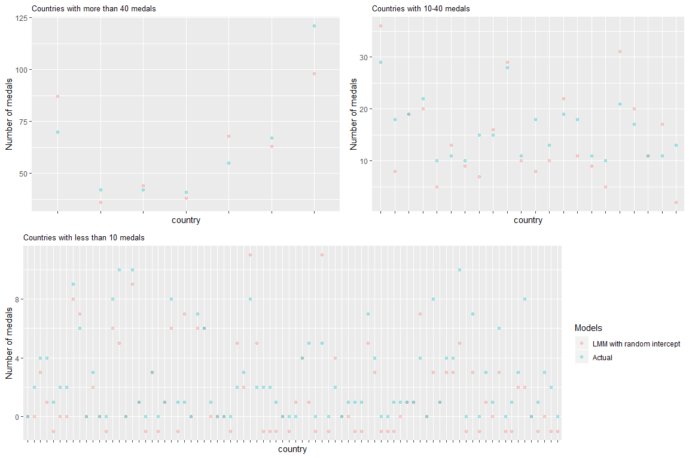

Tetiana Stroganova
26/07/2019

## Predicting the 2016 Olympic Medals Using General Linear Models and Linear Mixed Models

-----

## 1\. Introduction

The goal of the project is to predict the total number of medals won by
each country in 2016 Olympics based on several predictors available
before August 2016. The questions of interest are the following:

  - Which variables are associated with the total number of medals won
    by each country in 2012?
  - How well does the model predict the 2016 results?
  - What improvements might be made to the model/data collected to
    increase the predicting performance?

## 2\. Data description and methodology

### 2.1 Data description

The data set rioolympics.csv contains observations for each of the
countries - participants of 2016 Rio Olympics with the following
variables (all the YY variables are for 2000, 2004, 2008, 2012 and 2016
years):

Numerical variables:

  - **gdpYY**: the country’s GPD in millions of US dollars during year
    YY,
  - **popYY**: the country’s population in thousands in year YY,
  - **goldYY**: number of gold medals won in the YY Olympics,
  - **totYY**: total number of medals won in the YY Olympics,
  - **totgoldYY**: overall total number of gold medals awarded in the YY
    Olympics,
  - **totmedalsYY**: overall total number of all medals awarded in the
    YY Olympics,
  - **bmi**: average BMI (not differentiating by gender),
  - **altitude**: altitude of the country’s capital city,
  - **athletesYY**: number of athletes representing the country in the
    YY Olympics.

Categorical variables:

  - **country**: the country’s name,
  - **country.code**: the country’s three-letter code,
  - **soviet**: 1 if the country was part of the former Soviet Union, 0
    otherwise,
  - **comm**: 1 if the country is a former/current communist state, 0
    otherwise,
  - **muslim**: 1 if the country is a Muslim majority country, 0
    otherwise,
  - **oneparty**: 1 if the country is a one-party state, 0 otherwise,
  - **host**: 1 if the country has hosted/is hosting/will be hosting the
    Olympics, 0 otherwise.

### 2.2 Handling missing data

The exploration of the data has revealed that there are three columns
with missing data: bmi, gdp00 and gdp16. The bmi column missing values
are for the following countries: Armenia, Azerbaijan, Bahamas, Bahrain,
Botswana, Cameroon, Cyprus, Czech Republic, Dominican Republic, Fiji,
Gabon, Georgia, Guatemala, Ivory Coast, Kosovo, Kyrgyzstan, Mongolia,
Niger, Paraguay, Puerto Rico, Sudan, Tajikistan, Togo, Trinidad and
Tobago, Uganda, Uzbekistan, Zimbabwe. The missing values have been
inserted for all
[countries](https://en.wikipedia.org/wiki/List_of_countries_by_body_mass_index#WHO_Data_on_Mean_BMI_\(2014\)),
except Kosovo and Puerto Rico, where the data is not available. These
two missing values have been replaced with the overall mean of the bmi
column (excluding the missing values). The missing values in gdp00 (
[Afghanistan](https://countryeconomy.com/gdp/afghanistan?year=2000) )
and gdp16 ( [Cuba](https://countryeconomy.com/gdp/cuba) and [Syrian Arab
Republic](https://countryeconomy.com/gdp/syria) ) columns have also been
filled in.

### 2.3 Methodology

Two different approaches were used for the analysis: the wide format and
the longitudinal analysis. Before explaining each method, it’s worth
mentioning that in both approaches, the gdp parameter was not used as
such but was transformed into gdp\_per\_cap – GDP per capita (dividing
GDP by population) for a better comparison. Let us now describe the two
methods.

#### 2.3.1 Wide format analysis

Initially, the data set was presented in wide format, so each
measurement of the same variable taken at different points of time was
considered as a separate variable. To avoid repetition in the analysis,
the mean values have been used instead of separate measurements for each
of these time-related numerical predictors (gdp, pop, tot, gold,
athletes). As taking the mean of total number of medals awarded would
result in a single number for the whole data set, this variable would
not have any impact on the fitted model, so the totgold and totmedals
predictors have not been included in the wide format analysis. The data
have then been split in training and test sets. The final training set
contains all the categorical and non-time related numerical variables,
2000-2012 means for all the time-related predictors (except for the
previous performance of each country, where the mean only includes
2000-2008 data), and the response variable tot corresponds to the total
number of medals won by each country in 2012. The test set consists of
all the categorical and non-time related numerical variables, 2016 data
for all the time-related predictors (except for the previous performance
of each country, where 2012 measurements are used), and the response
variable tot corresponds to the total number of medals won by each
country in 2016. We will fit the quasipoisson and the negative binomial
models, using these data, as well as their zero-inflated versions.

#### 2.3.2 Longitudinal analysis

The long format method suggests that each time-related variable be
gathered in one column and a separate column “year” be created. So,
instead of having 5 columns for pop parameter, we will only have one pop
column with all the measurements and the year column. To keep the
previous performance as predictor, new columns prevtot and prevgold (N-1
performance for each year) have been created and then transposed along
with the other columns. [1996
results](https://en.wikipedia.org/wiki/1996_Summer_Olympics_medal_table)
for both total number of medals and gold medals have been added to the
data set as previous performance for 2000 year. The missing values in
these columns have been replaced by 0. The final training data set
contains all the categorical variables, non-time related variables, time
measurements column “year” up to and including 2012, one column for each
time-related variable and prevtot, prevgold columns. The test data set
only contains 2016 data in terms of time-related variables, prevtot and
prevgold columns (with 2012 performance) and all the categorical and
non-time related numerical variables.

This representation of data will allow us to fit the mixed linear
models.

#### 2.3.3 Predictive performance measurements

As the goal of the project is prediction, we need to specify the
measurements we will use to evaluate the models and to select the best
one. The following metrics will be calculated and compared
( is the difference
between the real values of the response variable and the fitted values):

  - Root mean squared error:
    
    

  - Mean absolute error:
    
    

The model with the lowest RMSE and MAE will be considered the most
powerful in terms of prediction and will be selected as the best.

## 3\. Wide format analysis

### 3.1 Exploratory analysis

Before fitting any model, let us check if there are any visible trends
in the data and any correlation between numerical predictors. As can be
seen on the pairs plot below, the response variable tot is highly
positively correlated with athletes, prevtot and prevgold predictors,
and moderately positively correlated with pop parameter. The
scatterplots confirm this pattern, showing a positive linear trend. At
the same time, prevtot, prevgold and athletes predictors strongly
correlate one with another. Consequently, we will only include one of
these three variables in our models – the prevtot variable. The
individual scatterplots also show that a log transformation of bmi,
altitude, pop and gdp\_per\_cap variables could be useful.



With regards to the categorical variables, as shown on the plots below,
the countries hosting the competition, communist countries and one-party
countries seem to win higher number of medals. It should be mentioned
however that there are only three one-party countries with China having
a very high number of medals, so the boxplot is heavily influenced by
this observation.





Before including the categorical variables in the models, we need to
check whether they are mutually independent. Two methods will be used to
assess the independence: the chi-squared test and Fisher test. The
results of the check are given below:

| Variables           | Chi.squared.test | Fisher.test | Independence    |
| :------------------ | ---------------: | ----------: | :-------------- |
| oneparty vs. comm   |             0.31 |        0.15 | independent     |
| oneparty vs. soviet |             1.00 |        1.00 | independent     |
| oneparty vs. muslim |             0.97 |        1.00 | independent     |
| oneparty vs. host   |             1.00 |        0.44 | independent     |
| soviet vs. muslim   |             0.98 |        0.71 | independent     |
| soviet vs. comm     |             0.00 |        0.00 | associated      |
| soviet vs. host     |             0.47 |        0.46 | independent     |
| comm vs. muslim     |             0.47 |        0.39 | independent     |
| comm vs. host       |             0.19 |        0.15 | independent     |
| muslim vs. host     |             0.06 |        0.02 | on the boundary |

It can be concluded from the association check that the soviet and comm
predictors are not independent. Therefore, we will only use the comm
variable for the further analysis and will drop the soviet predictor.
The goal of the project being the prediction of total number of medals
won by each country, we will consider a Poisson model, as it’s suitable
for a count response. The main assumption of this model is that the mean
and variance are equal. The mean of the response variable is equal to
8.85 and the variance – to 294.09.

This indicates overdispersion of the data. A quasi-poisson and a
negative binomial will be appropriate for this data and will allow us to
deal with the overdispersion. As can be seen on the histogram, there are
quite a lot of zeros in the distribution (22.2%):



Considering the high number of zeros in the distribution of the response
variable, the zero-inflated versions of quasi-poisson and negative
binomial models can also be considered.

### 3.2 Fitting the models

#### 3.2.1 Quasi-poisson model

We have fitted the quasi-poisson model including all the predictors:

``` r
mod1<-glm(tot~comm+oneparty+host+bmi+altitude+pop+gdp_per_cap+prevtot,family=quasipoisson,data=trainoldat)
```

and then have subsequently dropped insignificant variables one by one,
using F test to evaluate the significance of the predictors. The final
model consists of comm, host and prevtot parameters, the dispersion
parameter is 4.33:

    ## 
    ## Call:
    ## glm(formula = tot ~ comm + host + prevtot, family = poisson, 
    ##     data = trainoldat)
    ## 
    ## Deviance Residuals: 
    ##     Min       1Q   Median       3Q      Max  
    ## -4.2027  -2.3861  -0.9296   0.6478   6.4369  
    ## 
    ## Coefficients:
    ##             Estimate Std. Error z value Pr(>|z|)    
    ## (Intercept)  1.04615    0.13010   8.041 8.91e-16 ***
    ## comm1        0.41611    0.15412   2.700  0.00694 ** 
    ## host1        1.41361    0.20382   6.935 4.05e-12 ***
    ## prevtot      0.02227    0.00272   8.187 2.68e-16 ***
    ## ---
    ## Signif. codes:  0 '***' 0.001 '**' 0.01 '*' 0.05 '.' 0.1 ' ' 1
    ## 
    ## (Dispersion parameter for poisson family taken to be 4.32529)
    ## 
    ##     Null deviance: 2009.14  on 107  degrees of freedom
    ## Residual deviance:  451.79  on 104  degrees of freedom
    ## AIC: 752.78
    ## 
    ## Number of Fisher Scoring iterations: 5

As we can see from the output, the residual deviance of the model is
quite high, compared to the chi-squared distribution value for 104
degrees of freedom – 451.79 against 128.80, indicating a lack of fit.
The AIC parameter is quite high as well at 752.78. Nevertheless, as the
goal of the project is prediction, we will evaluate all the models based
on their predictive performance rather than on the goodness of fit.

#### 3.2.2 Negative binomial model

Similarly, we have fitted the negative binomial model, including all the
predictors and then have dropped the insignificant variables, using the
p-value as metric. The final model includes the same predictors as the
quasi-poisson: comm, host and prevtot. In contrast, it offers a better
fit, as the residual deviance is lower than the chi-squared distribution
value for 104 degrees of freedom – 124.55 against 128.80. It also gives
the lower AIC at 567.28:

    ## 
    ## Call:
    ## glm.nb(formula = tot ~ comm + host + prevtot, data = trainoldat, 
    ##     init.theta = 1.484697983, link = log)
    ## 
    ## Deviance Residuals: 
    ##     Min       1Q   Median       3Q      Max  
    ## -1.9695  -1.2416  -0.5059   0.3514   2.2845  
    ## 
    ## Coefficients:
    ##             Estimate Std. Error z value Pr(>|z|)    
    ## (Intercept) 0.763192   0.128395   5.944 2.78e-09 ***
    ## comm1       0.560432   0.226993   2.469  0.01355 *  
    ## host1       0.959452   0.323476   2.966  0.00302 ** 
    ## prevtot     0.046610   0.007117   6.549 5.80e-11 ***
    ## ---
    ## Signif. codes:  0 '***' 0.001 '**' 0.01 '*' 0.05 '.' 0.1 ' ' 1
    ## 
    ## (Dispersion parameter for Negative Binomial(1.4847) family taken to be 1)
    ## 
    ##     Null deviance: 317.58  on 107  degrees of freedom
    ## Residual deviance: 124.55  on 104  degrees of freedom
    ## AIC: 567.28
    ## 
    ## Number of Fisher Scoring iterations: 1
    ## 
    ## 
    ##               Theta:  1.485 
    ##           Std. Err.:  0.315 
    ## 
    ##  2 x log-likelihood:  -557.276

#### 3.2.3 Normal linear model

The next model that has been fitted is the normal linear model. The
variables selection has been executed, using the stepwise selection
(step() function in R) and p-value metric. The final model consists of
pop and prevtot parameters, the AIC is 644.63:

    ## 
    ## Call:
    ## lm(formula = tot ~ pop + prevtot, data = trainoldat)
    ## 
    ## Residuals:
    ##      Min       1Q   Median       3Q      Max 
    ## -14.1108  -1.5209  -0.1782   1.4844  30.3377 
    ## 
    ## Coefficients:
    ##              Estimate Std. Error t value Pr(>|t|)    
    ## (Intercept) 1.013e-01  5.104e-01   0.198 0.843133    
    ## pop         1.091e-05  2.900e-06   3.763 0.000277 ***
    ## prevtot     9.503e-01  2.990e-02  31.781  < 2e-16 ***
    ## ---
    ## Signif. codes:  0 '***' 0.001 '**' 0.01 '*' 0.05 '.' 0.1 ' ' 1
    ## 
    ## Residual standard error: 4.676 on 105 degrees of freedom
    ## Multiple R-squared:  0.927,  Adjusted R-squared:  0.9256 
    ## F-statistic:   667 on 2 and 105 DF,  p-value: < 2.2e-16

The residuals plots indicate the violation of heteroscedasticity and
normal distribution assumptions due to the outliers. We will not remove
these outliers, as we care about all the countries predictions. We will
still consider the normal linear model along with the others.


#### 3.2.4. Zero-inflated models

As revealed during the exploratory analysis, the zero-inflated models
seem appropriate for the data. We have fitted both zero-inflated
quasi-poisson and negative binomial models. The prevtot variable has
been used as covariate for the zero-inflation part of the model and
comm, host predictors have been put in the poisson / negative binomial
parts of the models. As illustrated by the R output below, the
zero-inflation coefficient is significant for the poisson model, so the
increase of prevtot predictor diminishes the odds of not receiving any
medal at all.

    ## 
    ## Call:
    ## zeroinfl(formula = tot ~ comm + host | prevtot, data = trainoldat)
    ## 
    ## Pearson residuals:
    ##     Min      1Q  Median      3Q     Max 
    ## -4.9539 -0.8576 -0.3698  0.6231 13.7660 
    ## 
    ## Count model coefficients (poisson with log link):
    ##             Estimate Std. Error z value Pr(>|z|)    
    ## (Intercept)  1.15171    0.07270   15.84   <2e-16 ***
    ## comm1        0.91129    0.07380   12.35   <2e-16 ***
    ## host1        2.21358    0.07521   29.43   <2e-16 ***
    ## 
    ## Zero-inflation model coefficients (binomial with logit link):
    ##              Estimate Std. Error z value Pr(>|z|)   
    ## (Intercept) -0.001438   0.358142  -0.004  0.99680   
    ## prevtot     -0.676981   0.247790  -2.732  0.00629 **
    ## ---
    ## Signif. codes:  0 '***' 0.001 '**' 0.01 '*' 0.05 '.' 0.1 ' ' 1 
    ## 
    ## Number of iterations in BFGS optimization: 11 
    ## Log-likelihood: -464.2 on 5 Df

The corresponding zero-inflation coefficient for the negative binomial
model is insignificant:

    ## 
    ## Call:
    ## zeroinfl(formula = tot ~ comm + host | prevtot, data = trainoldat, 
    ##     dist = "negbin")
    ## 
    ## Pearson residuals:
    ##     Min      1Q  Median      3Q     Max 
    ## -1.0922 -0.6485 -0.3031  0.2999  3.2126 
    ## 
    ## Count model coefficients (negbin with log link):
    ##             Estimate Std. Error z value Pr(>|z|)    
    ## (Intercept)   1.1255     0.1503   7.490 6.91e-14 ***
    ## comm1         0.8393     0.2254   3.724 0.000196 ***
    ## host1         2.2307     0.2372   9.402  < 2e-16 ***
    ## Log(theta)    0.3703     0.2092   1.771 0.076626 .  
    ## 
    ## Zero-inflation model coefficients (binomial with logit link):
    ##             Estimate Std. Error z value Pr(>|z|)  
    ## (Intercept)  -0.3765     0.4977  -0.756   0.4494  
    ## prevtot      -0.9160     0.4766  -1.922   0.0546 .
    ## ---
    ## Signif. codes:  0 '***' 0.001 '**' 0.01 '*' 0.05 '.' 0.1 ' ' 1 
    ## 
    ## Theta = 1.4482 
    ## Number of iterations in BFGS optimization: 14 
    ## Log-likelihood:  -286 on 6 Df

We can compare the AIC parameters, measuring the trade-off between the
goodness of fit and the simplicity of the models:

| Quasi-poisson | Negative Binomial | Normal linear | Zero-inflated poisson | Zero-inflated negative binomial |
| ------------: | ----------------: | ------------: | --------------------: | ------------------------------: |
|        752.78 |            567.28 |        644.63 |                938.41 |                          583.97 |

As illustrated by the table, the negative binomial model performs the
best in terms of the fit, but considering the goal of the project, we
will not exclude any of the models at this stage.

### 3.3 Longitudinal analysis

#### 3.3.1 Exploratory analysis

A different approach to the time-related data has been applied in the
long format analysis, compared to the wide one, so the relationship
between the variables may have changed. We need to check these
relationships and the potential correlation between the variables again.
As demonstrated by the pairs plot below, similarly to the wide format
analysis results, the response variable has a high positive correlation
with athletes, prevgold and prevtot predictors and a moderate positive
correlation with pop parameter. The prevtot, prevgold and athletes
variables are mutually strongly positively correlated. Therefore, we
will only include the prevtot predictor out of the three parameters
mentioned above. The new variables, included in the analysis, such as
totgold and totmedals are highly correlated with year. So, we will only
consider the year predictor in our model.

The categorical variables, used in the longitudinal approach, are the
same as in the wide one, so the findings from the exploratory analysis
mentioned above are relevant here as well. This means, we will drop the
soviet variable and only include the comm predictor in our models due to
their dependence.

#### 3.3.2 Linear mixed models

A linear mixed model is appropriate for the data in a long format with
repeated measurements over time. The following predictors can be
considered as random effects: comm, muslim, oneparty, host, country,
muslim:country, comm:country, host:country, oneparty:country. The first
model we have considered is a mixed linear model with a random
intercept. A model including all the numerical predictors as fixed
effects and country variable as a random effect has been created:

``` r
lin.mix.mod<-lmer(tot ~ year+gdp_per_cap+pop+prevtot+bmi+altitude+(1|country),data=long.training)
```

A stepwise selection using conditional AIC parameter has been applied
(stepcAIC() function in R) and this has resulted in the following mixed
linear model with two intercepts:

    ## lmer(formula = tot ~ year + gdp_per_cap + pop + prevtot + bmi + 
    ##     altitude + (1 | host) + (1 | oneparty), data = long.training)

Looking at the confidence intervals of the model, the oneparty random
intercept as well as gdp\_per\_cap, pop, bmi and altitude parameters are
insignificant, they have been dropped one by one, checking the
confidence intervals each time.

    ##                         2.5 % 97.5 %
    ## sd_(Intercept)|host      0.98  10.33
    ## sd_(Intercept)|oneparty  0.00   6.12
    ## sigma                    4.97   5.68
    ## (Intercept)             34.76 503.70
    ## year                    -0.25  -0.02
    ## gdp_per_cap             -0.04   0.03
    ## pop                      0.00   0.00
    ## prevtot                  0.84   0.93
    ## bmi                     -0.16   0.43
    ## altitude                 0.00   0.00

The final random intercept model includes year and prevtot predictors as
fixed effects and host variable as a random effect:

``` r
mod.intercept<-lmer(tot~year + prevtot + (1 | host),data=long.training)
```

We have tried to include the random slope parameter in both correlated
and uncorrelated versions, but the slopes are insignificant in both
models, as demonstrated below:

  - Model with correlated intercept and slope random effects:

<!-- end list -->

``` r
mod.slope<-lmer(tot~year + prevtot + (1 +prevtot| host),data=long.training)
```

Confidence intervals:

    ##                              2.5 % 97.5 %
    ## sd_(Intercept)|host           0.66   8.22
    ## cor_prevtot.(Intercept)|host -0.23   1.00
    ## sd_prevtot|host               0.00   0.29
    ## sigma                         5.03   5.75
    ## (Intercept)                  52.27 509.14
    ## year                         -0.25  -0.02
    ## prevtot                       0.68   1.03

  - Model with uncorrelated intercept and slope random effects:

<!-- end list -->

``` r
mod.slope.uncorr<-lmer(tot~year + prevtot + (1|host)+(0 +prevtot| host),data=long.training)
```

Confidence intervals:

    ##                     2.5 % 97.5 %
    ## sd_(Intercept)|host  0.70   8.76
    ## sd_prevtot|host      0.00   0.29
    ## sigma                5.04   5.77
    ## (Intercept)         54.02 511.90
    ## year                -0.25  -0.03
    ## prevtot              0.70   1.04

So, the final model that will be used for prediction is the random
intercept model. As the goal of the project is prediction, we will not
look at the coefficients in detail.

## 4\. Models comparison and final model selection

The predictions have been calculated for both training and test data
set, using predict() function. We can now compare all the models
described above, using MAE and RMSE parameters and will select the most
powerful model. The accuracy() function from forecast package has been
used to calculate the predictive performance metrics. The table below
shows the results for both training and test data sets:

**2012 Prediction:**

|                                 |  RMSE |   MAE |
| ------------------------------- | ----: | ----: |
| Quasi-poisson                   |  6.84 |  4.11 |
| Negative binomial               | 65.15 | 13.50 |
| Zero-inflated poisson           | 10.45 |  5.18 |
| Zero-inflated negative binomial | 10.69 |  5.39 |
| Normal linear                   |  4.61 |  2.63 |
| LMM with random intercept       |  3.77 |  2.41 |

**2016 Prediction:**

|                                 |  RMSE |   MAE |
| ------------------------------- | ----: | ----: |
| Quasi-poisson                   |  8.56 |  4.59 |
| Negative binomial               | 82.36 | 16.09 |
| Zero-inflated poisson           | 11.65 |  5.36 |
| Zero-inflated negative binomial | 11.76 |  5.52 |
| Normal linear                   |  5.05 |  2.59 |
| LMM with random intercept       |  4.41 |  2.64 |

As illustrated in the tables, the mixed linear model with random
intercept offers the best results in terms of prediction for both
training and test data sets with RMSE at 3.77 and 4.41 and MAE at 2.41
and 2.64 respectively. Consequently, this model will be selected as the
final one. The visual representation of the 2016 prediction results for
all the models is given below. Interestingly, the negative binomial
model, which didn’t show any lack of fit, has the worst predictive
performance:



The final model predictions against the actual values plots can be seen
below:



## 5\. Comparison with online predictions

We can now compare the predictions obtained, using the final model with
the predictions available online. Let us compare the results for the [6
best performing
countries](https://www.topendsports.com/events/summer/medal-tally/predicted-2016.htm)
:

| country        | Actual | LMM with random intercept | WSJ | Goldman\_Sachs | Gonzales\_Tuck\_School | Forrest | Bredtmann | Kupper |
| :------------- | -----: | ------------------------: | --: | -------------: | ---------------------: | ------: | --------: | -----: |
| United States  |    121 |                        98 | 101 |            106 |                    105 |      99 |       100 |    102 |
| China          |     70 |                        87 |  82 |             89 |                     89 |      90 |        86 |     74 |
| United Kingdom |     67 |                        63 |  52 |             59 |                     67 |      51 |        64 |     43 |
| Russia         |     55 |                        68 |  51 |             58 |                     62 |      42 |        53 |     83 |
| France         |     42 |                        36 |  43 |             36 |                     35 |      30 |        34 |     37 |
| Germany        |     42 |                        44 |  51 |             46 |                     48 |      36 |        43 |     41 |

We can also compare the performance metrics for the models, based on the
6 observations:

|                           |  RMSE |   MAE |
| ------------------------- | ----: | ----: |
| WSJ                       | 12.02 | 10.17 |
| Goldman Sachs             | 10.89 |  9.17 |
| Gonzales (Tuck School)    | 11.19 |  9.17 |
| Forrest                   | 15.75 | 14.83 |
| Bredtmann                 | 11.37 |  8.50 |
| Kupper                    | 17.14 | 13.50 |
| LMM with random intercept | 13.18 | 10.83 |

As demonstrated above, our model is the 5th best performing, leaving
behind Forrest and Kupper models. Obviously, this comparison is quite
limited, all the observations would need to be compared to judge
objectively.

## 6\. Conclusions

The project’s target has been to predict the total number of medals for
each country, participating in 2016 Rio Olympics. The constraint of the
analysis has been to use the data available before the start of the
games – the data set rioolympics.csv. The missing data has been filled
in or replaced by the overall mean parameter (bmi for Kosovo and Puerto
Rico). The gdp predictor has been transformed into gdp per capita.

Two approaches to the data have been considered: the wide format and the
longitudinal analysis. In both cases, the training set included all the
previous years data up to and including 2012, the test set consisted of
2016 data (except for the previous performance predictors where 2012
data was used). For the wide format analysis, the time-related
covariates in the training set have been transformed by calculating the
means over 2000-2012 years (except for the previous performance where
the means were taken up to 2008 instead of 2012). In the long format
analysis, the previous performance predictors have been added as well
(including additional 1996 data, as previous performance for 2000 year).

The exploratory analysis in both approaches has revealed strong positive
correlation between prevtot, prevgold and athletes covariates and high
positive correlation between the response and each of these predictors.
Thus, only prevtot predictor out of the three covariates has been
included in models. In the long format analysis, the totmedals and
totgold have shown strong positive correlation with the year predictor,
only the latter has been considered in the models. The categorical
variables association check has resulted in excluding the soviet
variable from the analysis, due to its dependence on the comm predictor.
The distribution of the response variable indicated the presence of
potential overdispersion in the data as well as the excess of zeros.

Five models have been fitted within the wide format approach: the
quasi-poisson and negative binomial models (to account for the
overdispersion) and zero-inflated poisson and negative binomial models
(to take into consideration the excess of zeros). As per the AIC
comparison, the negative binomial model has shown the best performance
in terms of fit. Three mixed linear models have been fitted within the
long format approach: the random intercept model, the model with
correlated random intercept and slope and the model with uncorrelated
random intercept and slope. As result, only the random intercept model
has been retained.

The predictive performance of all the models has been evaluated for both
2012 and 2016 results, by calculating root mean squared error and mean
absolute error. Paradoxically, the negative binomial model has shown the
worst performance even if it was indicating no lack of fit. The best
model overall, is the mixed linear model with random intercept with RMSE
at 4.41 and MAE 2.64 for the 2016 predictions.

Finally, we have compared our best model performance with the
predictions available online from 6 different sources for top 6
countries in terms of total number of medals won in 2016. Our model is
the 5th best, when comparing RMSE and MAE metrics.

## 7\. Possible improvements

The below options could be explored to improve the predictive
performance:

  - Applying a log transformation of bmi, altitude, pop and
    gdp\_per\_cap predictors;
  - Exploring a different approach to time series data – using the
    lagged variables instead of calculating the means in the wide format
    analysis;
  - Including additional predictors (Olympic training funding, total
    governmental expenses on sports and health, media distractions,
    human development indexes, gender inequality etc);
  - Fitting a principal components regression – this model would help to
    overcome the multicollinearity of the data;
  - Including new random effects in the linear mixed model – more
    complex models in terms of the random effects’ combination could
    offer a better model;
  - Fitting a Poisson mixed model or a negative binomial mixed model.
